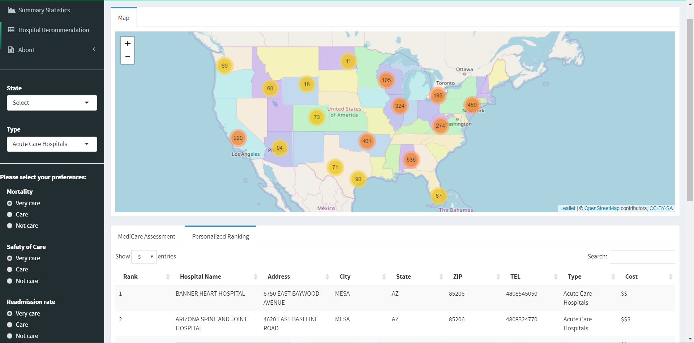

# Project 2: Open Data App - an RShiny app development project

## Project Title: Hospital for You
Term: Spring 2018

### Team #8
+ Team Members:
	+ team member: Guo, Xiaoxiao (email: xg2282@columbia.edu)
	+ team member: He, Shan (email: sh3667@columbia.edu)
	+ team member: Utomo, Michael (email: mu2251@columbia.edu)
	+ team member: Wen, Lan (email: lw2773@columbia.edu)
	+ team member: Yao, Jingtian (email: jy2867@columbia.edu)
  + presenter: Utomo, Michael
  
### **Project summary**: 

The 21st century is developing and changing rapidly. As a result, people are paying more attention to improve their quality of life as much as possible. Then, they realize how important keeping healthy is to maximize their happiness. Visiting a hospital is one of the most useful ways to ensure the health of a person. As a consequence, selecting the most appropriate one efficiently and effectively becomes really necessary and avoids unwanted troubles.

If you are thinking of finding a hospitla you can go, you can just save your time and look at our app. Our group has created an app helping you to find the best hospitals around you based on your preference on 7 aspects of hospitals including mortality, safety of care, readmission rate, patient experience, effectiveness of care, timeliness of care and efficient use of medical imaging. With your choice, it will be so easy to find the one fits you the best.

##### Find The Best One With Just One Click: https://spring-2018-project2-group8.shinyapps.io/group8/

-- User Manual:

--- Step 1: Choose the State you live in or you need to go to. Simultaneously, you can also specify the type of hospital you may go to.

--- Step 2: Choose how much do your care about on the each of the seven aspects of a hospital.

--- Step 3: Check the Medicare Assessment table for the basic information of all hospitals, and the most importantly check the Personalized Ranking table to see which are the best ones for you.

--- Step 4: Click on the map to see the exact location of the hospital and gogogo!

We can take a first look of how our app looks like:



### Your Health Cannot Wait! Find The Hospital And Keep Your Smile Forever Now!

### **Contribution statement**: 

([default](doc/a_note_on_contributions.md)) All team members contributed equally in all stages of this project. All team members approve our work presented in this GitHub repository including this contributions statement. 

Following [suggestions](http://nicercode.github.io/blog/2013-04-05-projects/) by [RICH FITZJOHN](http://nicercode.github.io/about/#Team) (@richfitz). This folder is orgarnized as follows.

```
proj/
├── app/
├── lib/
├── data/
├── doc/
└── output/
```

Please see each subfolder for a README file.

