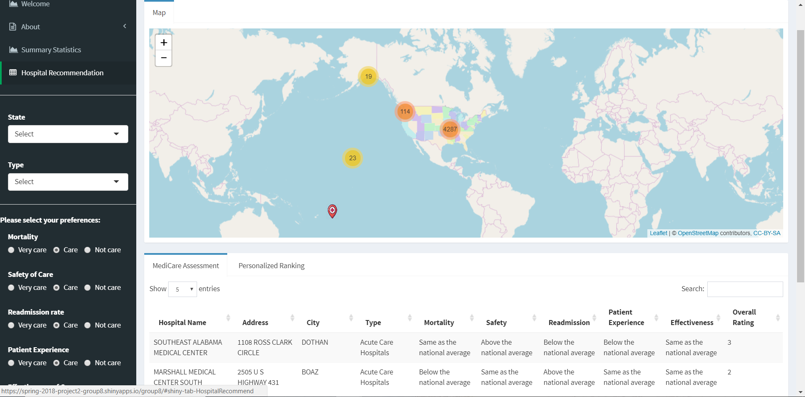

# Project 2: Open Data App - an RShiny app development project

## Project Title: Hospital for You
Term: Spring 2018

### **Team #8**
+ Team Members:
	+ team member: Guo, Xiaoxiao (email: xg2282@columbia.edu)
	+ team member: He, Shan (email: sh3667@columbia.edu)
	+ team member: Utomo, Michael (email: mu2251@columbia.edu)
	+ team member: Wen, Lan (email: lw2773@columbia.edu)
	+ team member: Yao, Jingtian (email: jy2867@columbia.edu)
  + presenter: Utomo, Michael
  
### **Project summary**: 

The 21st century is developing and changing rapidly. As a result, people are paying more attention to improve their quality of life as much as possible. Then, they realize how important keeping healthy is to maximize their happiness. Visiting a hospital is one of the most useful ways to ensure the health of a person. As a consequence, selecting the most appropriate one efficiently and effectively becomes really necessary and avoids unwanted troubles.

If you are thinking of finding hispitals you can go, you can just save your time and look at our app. Our group has created an app helping you to find the best hospitals around you based on your preferences on 7 aspects of hospitals including mortality, safety of care, readmission rate, patient experience, effectiveness of care, timeliness of care and efficient use of medical imaging. With your choice, it will be so easy to find the one fits you the best.

##### Find The Best One With Just One Click: https://spring-2018-project2-group8.shinyapps.io/group8/

-- User Manual:

--- Step 1: Choose the State you live in or you need to go to. Simultaneously, you can also specify the type of hospital you may go to.

--- Step 2: Choose how much do your care about on the each of the seven aspects of a hospital.

--- Step 3: Check the Medicare Assessment table for the basic information of all hospitals, and the most importantly check the Personalized Ranking table to see which are the best ones for you.

--- Step 4: Click on the map to see the exact location of the hospital and gogogo!

You can take a first look of how our app looks like:



### Your Health Cannot Wait! Find The HosAllpital And Keep Your Smile Forever Now!

### **Contribution statement**: 

Lan Wen and Jingtian Yao respectively found the dataset of hospital general information and payment dataset. All team members participated in group discussions and designed the content of this App. Xiaoxiao Guo, Jingtian Yao and Lan Wen merged the data and cleaned the data in the Excel. Shan He wrote the filter and table shiny UI and Server part. Lan Wen and Xiaoxiao Guo wrote the map Shiny UI and Server part. Jingtian Yao wrote the ranking UI and Server part. Michael Utomo built the Random Forest model and the code for the summary statistics and EDA, and Xiaoxiao Guo combined them into shiny UI and Server part. Shan He summarized the folder and deployed the app. In addition, Michael Utomo helped to resolve some of the issues that other team members have during the meetings, like issues on the Google Maps and issues of the ranking. Michael Utomo was also responsible for the About Me page and also the logos. All team members contributed to the GitHub repository. All team members approve our work presented in our GitHub repository including this contribution statement.

### **Reference**:

Some design ideas were inspired by the project 2 of Spring Semester 2017 Group 10. Author: Tongyue Liu, Yue Jin, Yijia Pan, Jia Hui Tan and Qingyuan Zhang. Columbia University, 2017.

Following [suggestions](http://nicercode.github.io/blog/2013-04-05-projects/) by [RICH FITZJOHN](http://nicercode.github.io/about/#Team) (@richfitz). This folder is orgarnized as follows.

```
proj/
├── app/
├── lib/
├── data/
├── doc/
└── output/
```
  
Please see each subfolder for a README file.

